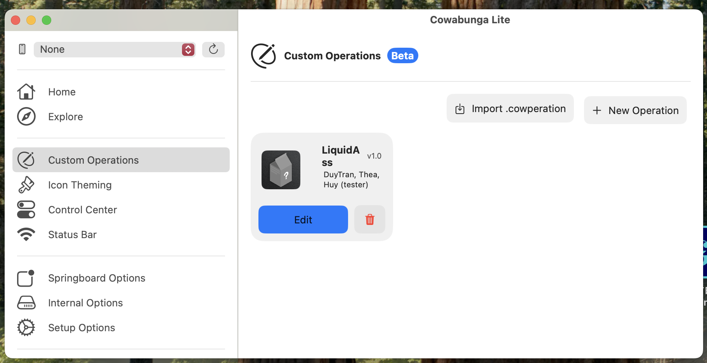

# Disable Liquid Glass

禁用iOS26的液态玻璃

# 教程

1. 首先下载Cowabunga Lite 2.1.2，并将Cowabunga Lite程序拖入“/Applications”，然后双击启动。（Cowabunga Lite后续简称CBL）

2. 下载“LiquidAss.cowperation”文件，双击导入到CBL。

并将你的苹果设备用数据线连接到电脑。

3. 在Custom Operations左边的项目点击后，点击右侧的Edit按钮，

再点击Enable按钮。

4. 最后点击左侧的Apply，再点击右侧的Apply Tweaks。

