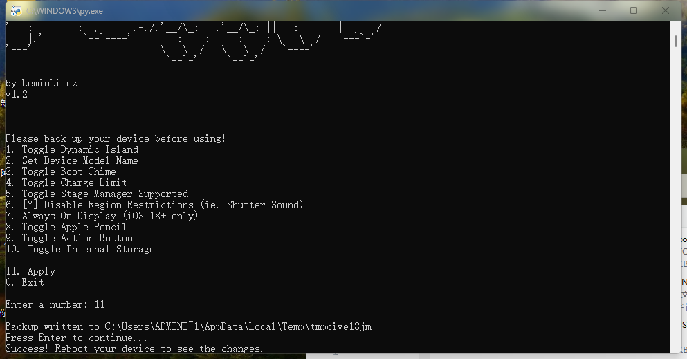
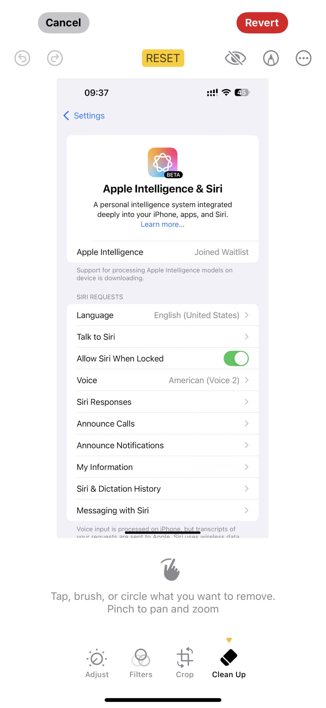
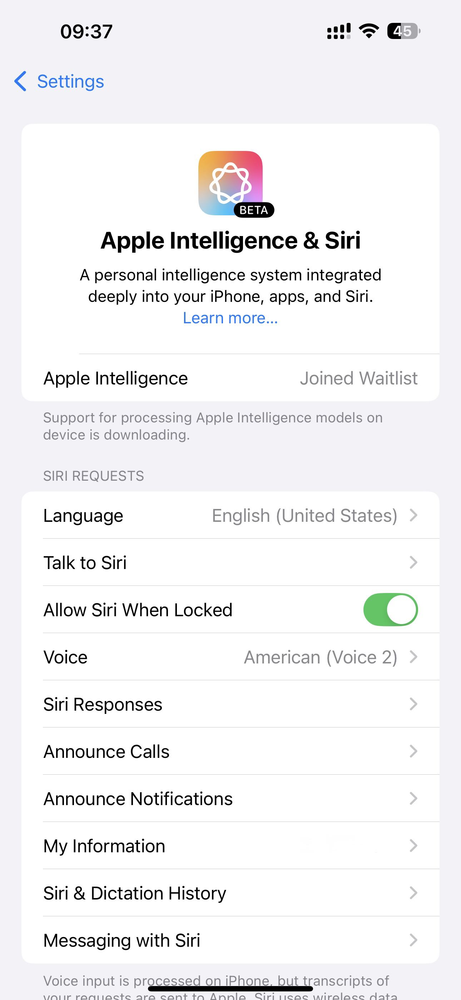

# How to Enable AI on CN Devices 

## 1. Environment:

1. iDevices: (Select one)

   (1) iPhone 15 Pro/PM & iOS 18.1 B1-B3 ;

​        (2) iPad: CPU is Silicon & iOS 18.1 B1-B3 ;

2. A Computer: Windows 10 or 11 / macOS 12 or above;

3. An adaptor: USB-C to USB-C or USB-C to USB-A

4. An Apple ID : Non China Mainland's Apple Account, e.g. US

   

   Tips: IF you used a China's account, you can use Photo's "Clean Up" Function ONLY.

## 2. Computer's Configuration:

1. Intall Python3, (Newest Version is 3.12.5).

   DL: https://www.python.org/downloads/

2. Intstall pymobiledevice3 (only needed once)

   pip install -r requirements.txt 

   (tips: "requirements.txt“ replaced to your full path)

3.  RUN "main_app.py":

   3.1 In Windows, you can double click "main_app.py"

   3.2 In macOS, you can Run terminal, then input "python3.12 main_app.py" (Not inlcluding "", "main_app.py" replaced to your full path)

   

## 3. To Get the MobileGestAlt File on iOS

You need to get the MobileGestAlt file that is specific to your device. To do that, follow these steps:

1. Install the `Shortcuts` app from the iOS app store.
2. Download this shortcut: https://www.icloud.com/shortcuts/d6f0a136ddda4714a80750512911c53b
3. Save the file and share it to your computer.
4. Place it in the same folder as the python file (or specify the path in the program)

## 4. Connecting

Using an adaptor to connect your iDevices to your Computer.

## 5. Using "Nugget" Program

  

1. Input Numer "6", Press "Enter";

2. Input Numer "11", Press "Enter";

3. When you see "Press Enter to Continue", then Press "enter" Again.
4. Edit your System Language and Siri Language to "English,US", Edit your System Region to US;

5. Reboot your iDevices.

## 效果图：

---

Nugget 软件下载地址：

https://github.com/LoveJessyChen/Nugget-iOS/releases

 

Nugget 软件国内网盘下载地址：

https://www.123pan.com/s/X5tA-Jabwh