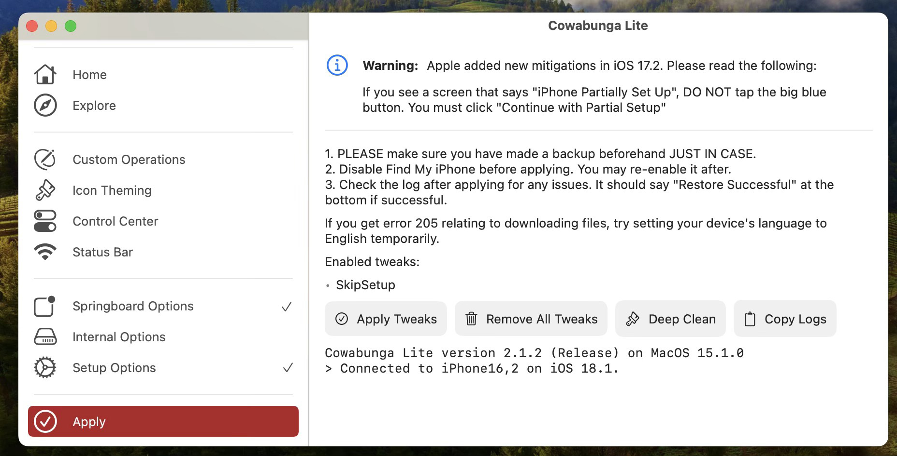

# Enable AirDrop Everyone Forever

## 1. 环境:

1. 苹果设备: (选择一项)

   (1) iPhone 

​        (2) iPad

2. 一台电脑: Windows 10 or 11 / macOS 12 or above;

3. 一根数据线: 

   iPhone 15 Series or later ：USB-C to USB-C or USB-C to USB-A

   iPhone 14 Series or below：Lightning to USB-C or Lightning to USB-A

## 2. 软件：

Cowabunga Lite for Mac 2.1.2 / Cowabunga Lite for Win 1.0.2 

## 3. 连接：

使用“数据线”将你的苹果设备连接到你的电脑。

## 4. 运行

(1) 选择左面板中的 "Springboard Options";

勾选 "Permanently Allow Receiving AirDrop From Everyone"

(2) 选择左面板中的 "Apply", 然后勾选右面板中的 "Apply Tweaks",

(3) 你的苹果设备将会自动重启.

