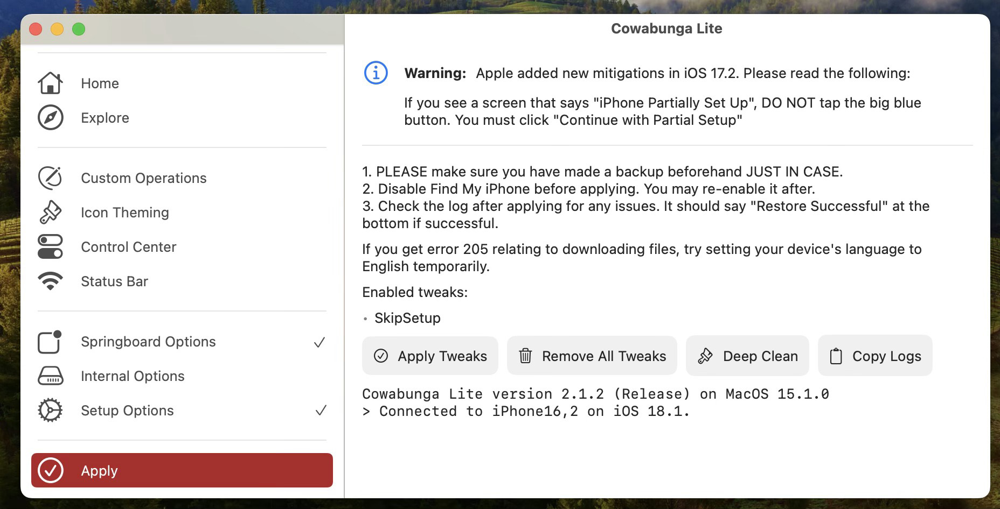

# Enable AirDrop Everyone Forever

## 1. Environment:

1. iDevices: (Select one)

   (1) iPhone 

​        (2) iPad

2. A Computer: Windows 10 or 11 / macOS 12 or above;

3. An adaptor: 

   iPhone 15 Series or later ：USB-C to USB-C or USB-C to USB-A

   iPhone 14 Series or below：Lightning to USB-C or Lightning to USB-A

## 2. Software

Cowabunga Lite for Mac 2.1.2 / Cowabunga Lite for Win 1.0.2 

## 3. Connecting

Using an adaptor to connect your iDevices to your Computer.

## 4. Run

(1) Choose Left Pannel's "Springboard Options";

Tick "Permanently Allow Receiving AirDrop From Everyone"

(2) Choose Left Pannel's "Apply", then Choose Right Pannel's "Apply Tweaks",

(3) Your iDevices will reboot Automatically.

