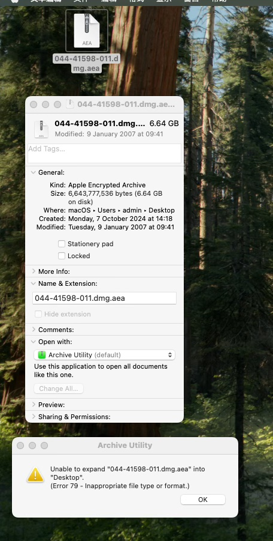

# 解密苹果固件中的AEA格式

To decrypt Apple Firmware‘s AEA Format

## 0.前言

苹果在iOS 18.0 db3 及其以后的版本启用新的AEA格式，直接双击AEA无法直接解压，keka可以弹出密码框但是输入正确密钥后 也解压不了。

## 1.环境

（1）一台苹果电脑/或者黑苹果PC机都可以，系统在macOS14+

（2）AEOTA工具：https://github.com/dhinakg/aeota

（3）iOS的ipsw固件：iOS 18.0 db3 及其以后的版本。

（提示：iOS17.x/iOS 18.0 db2 之前的版本没有加密，直接解压ipsw，直接找到里边大小最大的文件 大概超过6G）

---

本教程以iOS 18.0.1 （iPhone 16 pro）固件为准：iPhone17,1_18.0.1_22A3370_Restore.ipsw

## 2.使用方法

（0）准备工作：解压ipsw文件（iPhone17,1_18.0.1_22A3370_Restore.ipsw）

找到文件大小 最大的那一个文件。（本案例中是6.64G：044-41598-011.dmg.aea）

（1）安装Python 3.10+：

https://www.python.org/downloads/macos/

（2）安装依赖：pip3 install -r requirements.txt

（提示：requirements.txt 替换为你自己的完整路径。）

（3）获取密钥：python3 get_key.py <path to AEA>

（提示：“get_key.py”换成你自己的完整路径。“<path to AEA>”换成AEA文件所在路径。）

（示例：python3 /Users/admin/Documents/aeota-main/get_key.py /Users/admin/Desktop/044-41598-011.dmg.aea ）

此时按下回车后，将得到aea的解密的key。（iOS 18.0.1 的iPhone 16 pro中“044-41598-011.dmg.aea”的密钥是CKNB1kyVBx/8pc58zOvyOytk4V4trZRmlmVAdGPCxoQ= ）

（4）解密AEA：

aea decrypt -i <path to AEA> -o <decrypted output file> -key-value 'base64:<key in base64>'

（示例：aea decrypt -i /Users/admin/Desktop/044-41598-011.dmg.aea -o /Users/admin/Desktop/044-41598-011.dmg -key-value 'base64:CKNB1kyVBx/8pc58zOvyOytk4V4trZRmlmVAdGPCxoQ='）

(5)完成✅。

得到一个.dmg文件，此时可以双击打开它，就可以提取资源文件了。

（示例文件是044-41598-011.dmg，双击后就看到桌面上出现“Crystal22A3370.D93OS”的磁盘图标，在双击打开，就可以提取资源文件了。）

### 预览图

附件：

AEOTA工具：https://github.com/dhinakg/aeota

https://github.com/LoveJessyChen/aeota