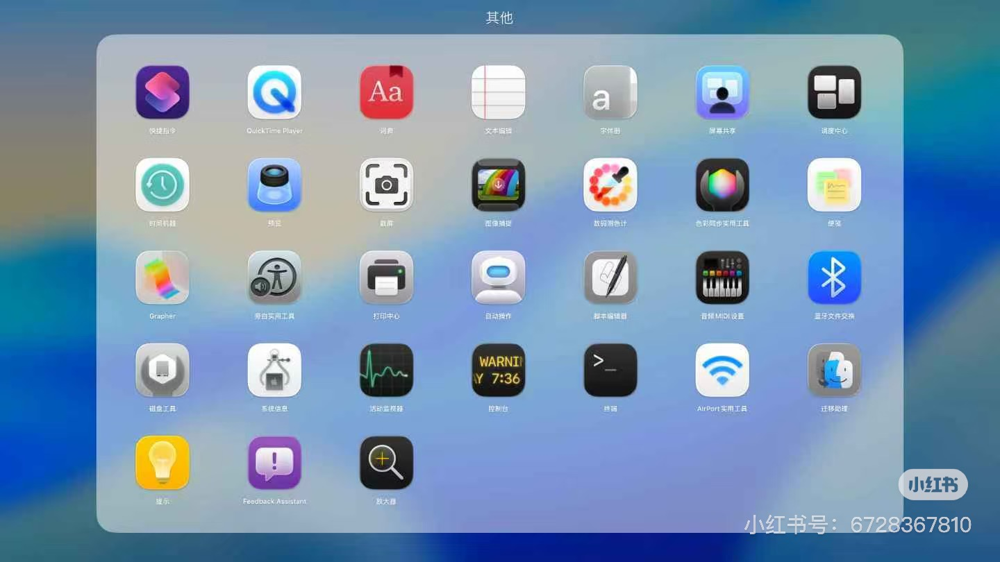
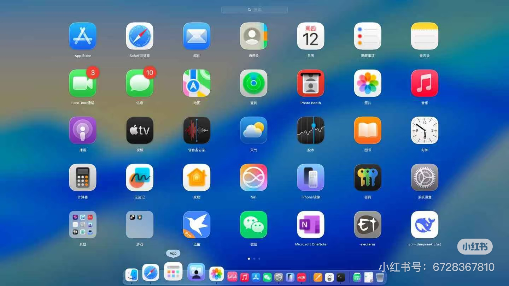

# macOS 26 Launchpad 启动台的恢复方法
   https://www.v2ex.com/member/MenglolitaBD

## 1 打开 终端，依次输入以下命令：
### 1.1 重置启动台：
defaults write com.apple.dock ResetLaunchPad -bool true

### 1.2 新建一个地方来存放覆盖的设置：
sudo mkdir -p /Library/Preferences/FeatureFlags/Domain

### 1.3 新建配置文件，启用老版的Launch Pad：
sudo defaults write /Library/Preferences/FeatureFlags/Domain/SpotlightUI.plist SpotlightPlus -dict Enabled -bool false

效果图：

